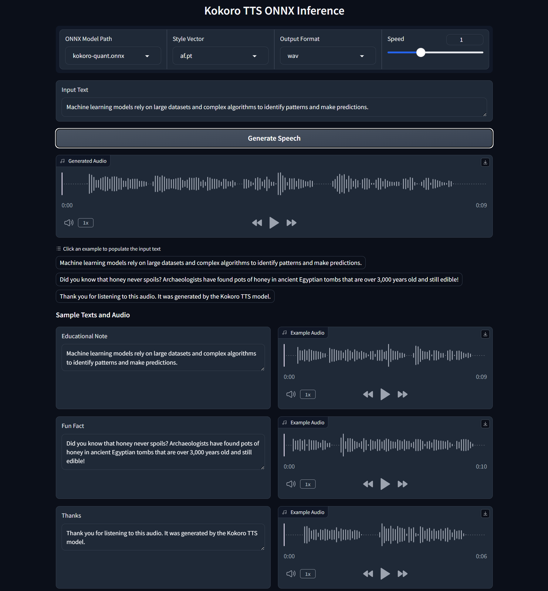

# Kokoro-82M ONNX Runtime Inference | Gradio Demo

[](https://huggingface.co/spaces/yakhyo/kokoro-82m)


[](https://github.com/yakhyo/kokoro-82m-onnx/stargazers)
[](https://github.com/yakhyo/kokoro-82m-onnx)

This repository contains minimal code and resources for inference using the **Kokoro-82M** model. The repository supports inference using **ONNX Runtime** and uses optimized ONNX weights for inference.

<table>
  <tr>
    <td>Machine learning models rely on large datasets and complex algorithms to identify patterns and make predictions.</td>
    <td>Did you know that honey never spoils? Archaeologists have found pots of honey in ancient Egyptian tombs that are over 3,000 years old and still edible!</td>
  </tr>
  <tr>
    <td align="center">
       <video controls autoplay loop src="https://github.com/user-attachments/assets/a8e9bfb7-777a-4b44-901c-c79c39c02c6f" ></video>
    </td>
    <td align="center">
      <video controls autoplay loop src="https://github.com/user-attachments/assets/358723ad-c0ab-44a3-90cc-64d89c042c9a" ></video>
    </td>
  </tr>
</table>

## Features

- **ONNX Runtime Inference**: Kokoro-82M (v0_19) Minimal ONNX Runtime Inference code. It supports `en-us` and `en-gb`.
- **Optimized ONNX Inference**: Mixed precision applied ONNX weights, faster inference and twice smaller in terms of size.

---

## Installation

1. Clone the repository:

   ```bash
   git clone https://github.com/yakhyo/kokoro-82m.git
   cd kokoro-82m
   ```

2. Install dependencies:

   ```bash
   pip install -r requirements.txt
   ```

3. Install `espeak` for text-to-speech functionality:
   Linux:
   ```bash
   apt-get install espeak -y
   ```

## Docker

```bash
docker build -t kokoro-docker . && docker run --rm -p 7860:7860 kokoro-docker
```

What this does:

1. Builds the Docker image and tags it as `kokoro-docker`.
2. Runs the container and maps port `7860` (container) to port `7860` (host).
3. Automatically removes the container when it stops (`--rm`).

Access your app at http://localhost:7860 once it's running.

---

## Usage

### Download ONNX Model

- [kokoro-quant.onnx](https://github.com/yakhyo/kokoro-82m/releases/download/v0.0.1/kokoro-quant.onnx) by [@taylorchu](https://github.com/taylorchu)
- [kokoro-v0_19.onnx](https://github.com/yakhyo/kokoro-82m/releases/download/v0.0.1/kokoro-v0_19.onnx) by [@hexgrad](https://huggingface.co/hexgrad/Kokoro-82M)

| **Filename**        | **Description**                    | **Size** |
| ------------------- | ---------------------------------- | -------- |
| `kokoro-quant.onnx` | Mixed precision model (**faster**) | 169MB    |
| `kokoro-v0_19.onnx` | Original model                     | 330MB    |

### Jupyter Notebook Inference Example

Run inference using the jupyter notebook:

[example.ipynb](example.ipynb)

### CLI Inference

Specify input text and model weights in `inference.py` then run:

```bash
python inference.py
```

### Gradio App

Run below start Gradio App

```bash
python app.py
```

<div align="center">
  
</div>


## License

This project is licensed under the [MIT License](LICENSE).

Model weights licensed under the [Apache 2.0](#license)


## Acknowledgments

- https://huggingface.co/hexgrad/Kokoro-82M
